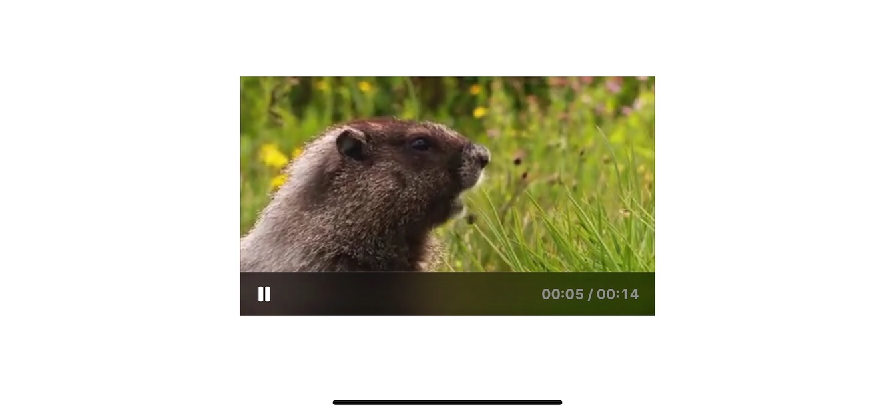

# SVEVideoPlayerView

SVEViewPlayerView is an iOS view that diplays videos.



## Installation

SVEViewPlayerView is available through [Swift Package Manager](https://swift.org/package-manager/). To install
it, simply add the following line to your `Package.swit`:
```
dependencies: [
    .package(url: "https://github.com/SergioEstevao/SVEVideoPlayerView.git", from: "0.1")
]
```
## Usage

To use the video player do the following:

### Import header

```` swift
import SVEVideoPlayerView
````

### Create and present the view

```` swift
let videoURL = Bundle.main.url(forResource: "video", withExtension: "mp4")
let videoView = VideoPlayerView(videoURL: videoURL)
view.addSubview(videoView)
videoView.play()
````

### Get notified about video events

You can set a delegate to the video view to get notified of the end of play and error situations.

```` swift
videoURL.delegate = self
...
func videoPlayerView(playerView: VideoPlayerView, didFailWithError error: Error) {
    print("Error: \(error)\n")
}

func videoPlayerViewStarted(playerView: VideoPlayerView) {
    print("Started\n")
}

func videoPlayerViewFinish(playerView: VideoPlayerView) {
    print("Finish\n")    
}
````

### How to present the video control toolbar

```` swift
videoView.showsPlayBackControls = true
````

### Sample Project

To run the example project, clone the repo, and open the `SVEVideoPlayerView.xcproject` file

## Requirements

 * AVFoundation
 * XCode 11 or above
 * iOS 11 or above

## Contributing

Read our [Contributing Guide](CONTRIBUTING.md) to learn about reporting issues, contributing code, and more ways to contribute.

## Getting in Touch

If you have questions about getting setup or just want to say hi, just drop an issue on Github with your request.

## Author

[Sérgio Estêvão](https://sergioestevao.com)

## License

SVEViewPlayerView is available under the MIT license. See the [LICENSE file](./LICENSE) for more info.
